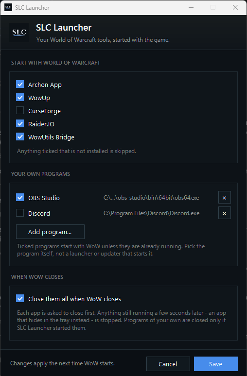

# SLC Launcher

**A launcher toolkit for managing your World of Warcraft tools.**

SLC Launcher starts the apps you play with — [Archon](https://www.archon.gg/),
[WowUp](https://wowup.io/), [CurseForge](https://www.curseforge.com/), the
[Raider.IO](https://raider.io/) client, WowUtils Bridge and any other program
you choose — when World of Warcraft launches. It can also close them again
when the game exits. You pick what's included in one small settings window,
and a background watcher does the rest.

It is part of the SLC family of WoW tools, alongside the SimpleLootCouncil
addon, and wears the same look.



- **Starts only what you pick.** Tick the apps you want; anything not installed
  is skipped, and anything already open is left alone.
- **Your own programs too.** Add any `.exe` — a voice client, a stream tool, a
  timer — and it starts with the game.
- **Closes them with the game, if you want.** One tick box, and the apps go
  when WoW does — including the ones that like to hide in the tray.
- **No tray icon, no window.** The watcher runs invisibly from logon. The only
  thing you ever open is the settings window.
- **Light.** One small PowerShell process polling once a second — about 0.03%
  of the CPU. See [What it costs](#what-it-costs).

## Contents

- [Install](#install)
- [The settings window](#the-settings-window)
- [Supported apps](#supported-apps)
- [Your own programs](#your-own-programs)
- [Closing them with the game](#closing-them-with-the-game)
- [Configuration](#configuration)
- [Troubleshooting](#troubleshooting)
- [How it works](#how-it-works)
- [Uninstall](#uninstall)

## Install

Windows 10 or 11. No administrator rights, nothing else to install first, and
no typing commands.

1. Download **`SLCLauncher-Setup-<version>.exe`** from the
   [releases page](https://github.com/Laxxzz/SLCLauncher/releases) and run it.
2. Click through the installer. Leave **Open SLC Launcher to choose your apps**
   ticked on the last page.
3. Tick what you want in the settings window that opens, and click **Save**.

Windows may show *"Windows protected your PC"* because the installer came from
the internet and isn't signed. Click **More info → Run anyway**.

SLC Launcher then appears in **Settings → Apps → Installed apps**, where you can
uninstall it like any other program. Running a newer Setup over the top updates
it and keeps your settings.

### Without the installer

The zip holds the same files. Extract it (right-click → Extract All; don't run
it from inside the zip), double-click **`Install.cmd`** and answer **Y** to
`Install SLC Launcher?`. Answering **N** cancels without touching a single file.
`Install.cmd` clears the downloaded-from-the-internet mark from the other files
itself. Both ways in install exactly the same thing.

### What gets installed

Setup and `Install.cmd` both:

- copies the watcher to `%LOCALAPPDATA%\SLCLauncher` and registers a hidden
  logon task that runs it, and starts it straight away (no reboot)
- builds `SLCLauncher.exe`, the settings app, and adds **SLC Launcher** to
  the Start menu
- confirms what it set up:

```
  starts  -> Archon, WowUp, CurseForge, Raider.IO and WowUtils Bridge, if installed
```

Running Setup or `Install.cmd` again — to update, say — keeps your settings.

**Coming from Archon Launcher?** SLC Launcher is its new name. Installing it
takes the old one over: your settings and log move across, and the old task,
Start menu entry and `%LOCALAPPDATA%\ArchonLauncher` folder are removed, so
the two never both watch for the game.

## The settings window

Open **SLC Launcher** from the Start menu, or run `SLCLauncher.exe` in
`%LOCALAPPDATA%\SLCLauncher`.

- **Start with World of Warcraft** — a tick box for each
  [supported app](#supported-apps).
- **Your own programs** — see [below](#your-own-programs).
- **When WoW closes** — see [Closing them with the game](#closing-them-with-the-game).

**Save** writes your choices to `config.json`. The watcher notices within a
second and reloads it — no reinstall, no restart — and the new settings apply
from the next time the game starts. Anything already running is left as it is.

Opening it a second time brings the open window to the front rather than a
second copy. Closing it leaves nothing running.

## Supported apps

| App | Found automatically | Notes |
| --- | --- | --- |
| [Archon](https://www.archon.gg/) | yes | Its own "launch with game" setting only works if Archon is already running — see [why](#why-archon-needs-this). |
| [WowUp](https://wowup.io/) | yes | WowUp-CF or the older WowUp. |
| [CurseForge](https://www.curseforge.com/) | yes | The standalone app. The version inside Overwolf has no program of its own to start. |
| [Raider.IO](https://raider.io/) client | yes | |
| WowUtils Bridge | yes | |

Everything is ticked to begin with. Leaving an app ticked that you don't have
costs nothing: the log notes `not installed - skipping` and carries on.

None of these apps can start themselves with the game, which is the gap this
tool fills. They are launched normally, so everything they do on their own —
Archon's overlay and combat-log upload, an addon manager's update check —
works exactly as usual.

Two things worth knowing about the addon managers. They may check for updates
on startup and want to write to your `AddOns` folder, which WoW reads at login,
so mid-session changes need a `/reload`. And CurseForge opens a real window,
which with the game in exclusive fullscreen means an alt-tab away. If either
bothers you, untick it.

## Your own programs

**Add program...** picks any `.exe` to start with the game. It is named after
the description the program gives itself, its tick box switches it on and off
without losing it, and **×** removes it.

They follow the same rules as the built-in apps, with two differences that come
from knowing a program only by its path:

- **It is not searched for.** If the file is not where you said, the log reads
  `not found at <path> - skipping`. An update that moves the program means
  adding it again.
- **"Already running" means a process with the same file name.** Pick the
  program itself, not a launcher or updater that starts it: a launcher's own
  process is gone a moment later, so it looks "not running" at every game start
  and gets started again each time. Discord is the common case — its shortcut
  runs `Update.exe`, which starts `Discord.exe` from a folder named after the
  version, so neither is a good choice. Leave Discord running from boot
  instead.

## Closing them with the game

With **Close them all when WoW closes** ticked, each app is first *asked* to
close, by sending its window the same message clicking **X** does. Archon and
CurseForge take that as "exit". WowUp and WowUtils Bridge take it as "hide to
the tray", and the Raider.IO client in the tray has no window to ask at all.

So asking is only the first move. Anything still running a few seconds later is
stopped outright:

```
[05:07:59] asked WowUp to close
[05:08:04] WowUp ignored the close request - stopped it
```

The grace period is shared by all of them rather than spent on each in turn.

[Your own programs](#your-own-programs) are closed only if SLC Launcher started
them for this game. They are recognised by file name, and closing every
`chrome.exe` because WoW exited would take the browser you had open all along.

Set `QuitGraceSeconds` to `0` if you would rather apps were only ever asked. A
forced stop is a forced stop, and an addon manager caught halfway through
writing to your `AddOns` folder will not finish the job. Five seconds of grace
makes that unlikely, not impossible. Turning off close-to-tray in WowUp's own
settings avoids it entirely.

## Configuration

The settings window covers the common settings. Everything lives in
`%LOCALAPPDATA%\SLCLauncher\config.json`, which you can also edit by hand; the
watcher reloads it within a second of a save. Keys the window does not show are
kept as they are when it saves. Empty or missing values mean the default:

```json
{
  "LaunchArchon":         true,
  "LaunchWowUp":          true,
  "LaunchCurseForge":     true,
  "LaunchRaiderIO":       true,
  "LaunchWowUtilsBridge": true,
  "CustomApps": [
    { "Name": "OBS Studio", "Path": "C:\\Program Files\\obs-studio\\bin\\64bit\\obs64.exe", "Enabled": true }
  ],
  "ArchonExe":            "",
  "WowUpExe":             "",
  "CurseForgeExe":        "",
  "RaiderIOExe":          "",
  "WowUtilsBridgeExe":    "",
  "GamePattern":          "^Wow(Classic|T|B)?$",
  "PollSeconds":          1,
  "LaunchDelaySeconds":   3,
  "QuitWithWow":          false,
  "QuitGraceSeconds":     5
}
```

| Key | Default | Meaning |
| --- | --- | --- |
| `LaunchArchon` … `LaunchWowUtilsBridge` | `true` | Start that app with the game, when it is installed. |
| `CustomApps` | none | [Your own programs](#your-own-programs). `Name` is what the log calls it and defaults to the file name; `Enabled` defaults to `true`. |
| `ArchonExe` … `WowUtilsBridgeExe` | auto-detected | The app's full path, for the rare install that [auto-detection](#how-apps-are-found) misses. Empty means "find it", not "don't launch it". |
| `GamePattern` | `^Wow(Classic\|T\|B)?$` | Regex against process names, no `.exe`. Covers retail, Classic, PTR (`WowT`) and beta (`WowB`). `^Wow$` is retail only. |
| `PollSeconds` | `1` | Seconds between checks. Minimum `1`. |
| `LaunchDelaySeconds` | `3` | Wait this long after spotting the game before starting the apps. `0` launches immediately. |
| `QuitWithWow` | `false` | Close the apps when the game exits. |
| `QuitGraceSeconds` | `5` | How long an app gets to close on its own before it is stopped. `0` only ever asks. |

A save that leaves the file unreadable, or `GamePattern` an invalid regex, is
logged and ignored: the watcher keeps the settings it already had.

To set things up before installing — for several machines, say — put a
`config.json` next to `Install.cmd`. The installer applies each key in it over
your current settings on every run, so remove it afterwards if you would rather
the settings window had the last word. `config.example.json` lists the keys.

### Command line

```powershell
powershell -ExecutionPolicy Bypass -File .\Install.ps1
powershell -ExecutionPolicy Bypass -File .\Install.ps1 -QuitWithWow -NoCurseForge
```

`-NoArchon`, `-NoWowUp`, `-NoCurseForge`, `-NoRaiderIO` and `-NoWowUtilsBridge`
untick that app and `-QuitWithWow` ticks the close box, exactly as the settings
window would; anything not mentioned keeps its current setting.
`-OpenSettings` opens the settings window afterwards, which is what
`Install.cmd` passes. `Install.cmd` with any arguments hands them straight to
`Install.ps1` and does not open the window.

## Troubleshooting

Double-click **`ViewLog.cmd`**, which is in the zip and, after Setup, in
`%LOCALAPPDATA%\SLCLauncher`. It shows the installed version, whether the
watcher is running, and recent activity:

```
  Installed version : 2.0.0
  Watcher           : RUNNING (pid 27612)
  Scheduled task    : installed
```

A healthy log looks like this. The startup block lists every app the watcher
manages and where it found each one, so it is the first place to look:

```
[2026-09-26 22:05:16] watcher started (pid 24196)
[2026-09-26 22:05:16] version   : 2.0.0
[2026-09-26 22:05:16] Archon    : C:\Program Files\Archon App\Archon App.exe
[2026-09-26 22:05:16] WowUp     : C:\Users\me\AppData\Local\Programs\wowup-cf\WowUp-CF.exe
[2026-09-26 22:05:16] Raider.IO : C:\Program Files\RaiderIO\RaiderIO.exe
[2026-09-26 22:05:16] watching  : ^Wow(Classic|T|B)?$  every 1s
[2026-09-26 22:05:16] delay     : 3s after the game is spotted
[2026-09-26 22:05:16] quit-with-wow: off
[2026-09-26 22:18:41] game detected (pid 1640)
[2026-09-26 22:18:41] already running: Raider.IO
[2026-09-26 22:18:41] waiting 3s before launching
[2026-09-26 22:18:44] launched C:\Program Files\Archon App\Archon App.exe
[2026-09-26 22:18:44] launched C:\Users\me\AppData\Local\Programs\wowup-cf\WowUp-CF.exe
[2026-09-26 23:47:02] game exited
```

**Nothing in the log after launching WoW.** The process name probably doesn't
match. Open Task Manager → Details while the game is running, note the exact
`.exe` name, and set `GamePattern` in `config.json` to match it (without the
`.exe`).

**An app doesn't start, and the log says `not installed - skipping`.**
Auto-detection found no install. If you do have it, set its `*Exe` key in
`config.json` to the full path. The likeliest cause is a CurseForge that runs
inside Overwolf, which has no `CurseForge.exe` of its own to start.

**A program of my own starts every time, even when it is already open.** You
picked a launcher rather than the program. See
[Your own programs](#your-own-programs).

**An app starts but stays behind the game.** Archon, for one, opens its window
without taking focus, so with the game in exclusive fullscreen you won't see it
until you alt-tab. It did start.

**The settings window says `The watcher is not running right now`.** The
heartbeat restarts it within 5 minutes; running `Install.cmd` starts it at
once. The scheduled task showing `Ready` rather than `Running` is normal: the
task exits as soon as it has started the watcher.

**An app closed while the game kept running, and didn't come back.** Expected:
the watcher acts on the game starting, not on an app disappearing.

**Setup says it could not finish installing.** It undoes what it did and names
the file that says why: `%LOCALAPPDATA%\SLCLauncher\install.log`.

**My settings are back to the defaults.** Uninstalling deletes
`%LOCALAPPDATA%\SLCLauncher`, settings and log included. Reinstalling over the
top instead keeps them.

## How it works

There are two parts, and only one of them is something you open:

- **SLC Launcher** (`SLCLauncher.exe`) is the settings window. It edits
  `config.json` and does nothing else.
- **The watcher** (`SLCWatcher.ps1`) does the launching and closing. It runs in
  the background from logon, with no window and no tray icon.

### The watcher

A scheduled task starts the watcher at logon. It checks for the WoW process
once a second, and when a new one appears it waits `LaunchDelaySeconds`, then
starts every chosen app that is installed and not already running. It tracks
the game by process id rather than by name, so a game that restarts while the
old process is still shutting down is still seen as a new launch. If the game
is already running when the watcher starts, it catches up straight away rather
than waiting for a launch that already happened.

The task also carries a **heartbeat**: every 5 minutes Windows checks the
watcher is alive and restarts it if not, so a killed watcher does not stay dead
until the next logon. A mutex stops duplicate starts from stacking up.

Nothing appears on screen. The task runs `wscript.exe` against a small shim
rather than `powershell.exe` directly, because Task Scheduler gives a console
process a console window every time it fires.

### How apps are found

The `*Exe` keys are optional because the watcher locates each app itself,
taking the first of these that exists on disk:

1. **The path in `config.json`**, if you set one.
2. **The app's uninstall registry entry** — its `InstallLocation`, then its
   `DisplayIcon`, then the folder holding its `UninstallString`.
3. **A running copy of the app**, whose own path is ground truth.
4. **The usual install locations.**

If a found path stops existing — an update moving the install — the search
runs again at launch time. An app installed after the watcher started is
picked up at the next game launch, without a restart.

### The settings app

The installer builds `SLCLauncher.exe` on your machine from `SLCLauncher.cs`
and `SLCTheme.cs`, with the C# compiler that is part of Windows' own .NET
Framework, rather than shipping a ready-made program: a downloaded `.exe` is
exactly what SmartScreen and antivirus look hardest at, while one built from
source you can read is plainly what it says it is. The window itself is
`SLCLauncherSettings.ps1`, run inside the program, so it shows in Task Manager
and on the taskbar as SLC Launcher with its own icon.

### The installer

`SLCLauncher-Setup-<version>.exe` is an [Inno Setup](https://jrsoftware.org/isinfo.php)
wrapper round `Install.ps1` and `Uninstall.ps1`, not a second copy of them. It
unpacks the same files, runs `Install.ps1` hidden and logs it to `install.log`,
and adds an entry to Settings → Apps whose uninstaller runs `Uninstall.ps1`.
The settings app is still built on your machine, so the installer carries no
ready-made program of its own besides Setup itself.

To build it you need Inno Setup 6, on the building machine only:

```powershell
winget install --id JRSoftware.InnoSetup -e --scope user
powershell -ExecutionPolicy Bypass -File .\installer\Build-Installer.ps1
```

That writes `dist\SLCLauncher-Setup-<version>.exe`, taking the version from
`$SLCLauncherVersion` in `SLCWatcher.ps1`.

### What it costs

Measured on a 16-core desktop with ~262 running processes, at the default
1-second interval:

| | Watcher |
| --- | --- |
| Processes | 1 |
| Private memory | ~103 MB (PowerShell's runtime, not the script) |
| CPU | 94 ms per 20 s — 0.47% of one core, **0.029% of all cores** |

Each check takes about 4 ms. Raising `PollSeconds` to `5` cuts the CPU by five
times, but both figures are far below the noise of normal desktop activity, so
pick the interval for responsiveness rather than performance. Adding apps costs
nothing per check: the extra work happens only when the game launches.

### Why Archon needs this

Archon has a **"launch with game"** setting, but it only opens the window of an
**already-running** Archon. The handler behind it lives in the app's own UI:
when it sees the game it asks Archon's window manager to open the main window —
a window that already exists. It never starts a process, and Archon ships no
service or resident helper to do so. Its game detection is loaded *inside*
`Archon App.exe`, so with Archon closed nothing is watching for the game.

You can see this in Archon's log at `%APPDATA%\Archon App\logs\main.log`: the
feature records a window action with the reason `Auto Launch on Game Start`,
always in a session that was already running. Archon's intended flow is to run
from boot and sit in the tray all day. SLC Launcher lets it start only when you
play.

### Notes

- Windows 10/11 and the PowerShell 5.1 that ships with them. No modules and
  nothing to download.
- Polling rather than process-creation events: event-driven detection needs
  administrator rights or an audit-policy change, and polling costs too little
  to justify either.
- Nothing here modifies, patches or injects into WoW or any app. It only starts
  their executables, and with `QuitWithWow` asks them to close and stops
  whatever ignored the request.

## Uninstall

Open **Settings → Apps → Installed apps**, find **SLC Launcher** and choose
**Uninstall**. If you installed from the zip, double-click **`Uninstall.cmd`**
and confirm instead.

Either way it removes the task, stops the watcher, closes the settings window
if it is open, removes the Start menu entry and deletes
`%LOCALAPPDATA%\SLCLauncher` — settings included. The apps it starts are not
touched.

From the command line, `-KeepFiles` leaves the folder and your settings in
place:

```powershell
powershell -ExecutionPolicy Bypass -File .\Uninstall.ps1 -KeepFiles
```

## License

Public domain / CC0. Do whatever you like with it.
